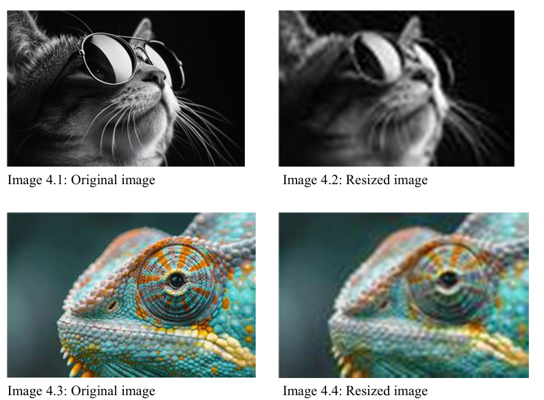

# IMAGE RESIZING AND COMPRESSION (MATLAB)

## Overview
This project implements a **MATLAB-based image resizing and compression tool** that reduces image size while preserving visual quality and aspect ratio.

The tool allows users to select an image, specify a desired quality percentage, and generate a resized version saved as a new file. It also provides a side-by-side visual comparison of the original and resized images, making it easy to evaluate quality changes.

---

## Objectives
- To resize images proportionally while preserving aspect ratio
- To reduce image file size for efficient storage and transmission
- To provide a simple and user-friendly MATLAB interface
- To visually compare original and resized images

---

## Working Principle
The tool follows a simple step-by-step workflow:
1. The user selects an image file from the system.
2. The user inputs a quality percentage (1–100).
3. New image dimensions are calculated based on the quality percentage.
4. The image is resized using MATLAB’s built-in functions.
5. The resized image is saved as a new file without altering the original.
6. Original and resized images are displayed side by side for comparison.

Aspect ratio is preserved throughout the resizing process to avoid image distortion.

---

## Features
- Supports common image formats (.jpg, .png, .bmp, .tiff)
- Preserves original image aspect ratio
- Saves resized image with automatic file naming
- Side-by-side image comparison
- Input validation for quality percentage

---

## Tools & Technologies
- MATLAB
- Image Processing Toolbox

---

## Results
- Successful resizing of images with reduced file size
- Visual quality maintained at reasonable compression levels
- Clear comparison between original and resized images
- Efficient and repeatable image processing workflow

---

## Output Comparison
The following image shows a visual comparison between the original images and their resized versions generated using the MATLAB tool.

---
## Applications
- Website optimization
- Email attachments
- Cloud storage management
- Digital content compression
- Multimedia preprocessing

---

## Limitations
- Processes one image at a time
- Compression based only on resizing
- Requires MATLAB environment

---

## Future Improvements
- Batch processing of multiple images
- Advanced compression techniques
- GUI-based interface
- Support for additional image formats
- Quality metrics such as PSNR or SSIM

---

## Conclusion
This project demonstrates an effective approach to image resizing and compression using MATLAB. By balancing file size reduction and visual quality, the tool provides a practical solution for modern digital image management tasks.
